# My-FIFA-World-Cup-Website

My FIFA World Cup website

## SiteMap

## WireFrame Examples
### index page
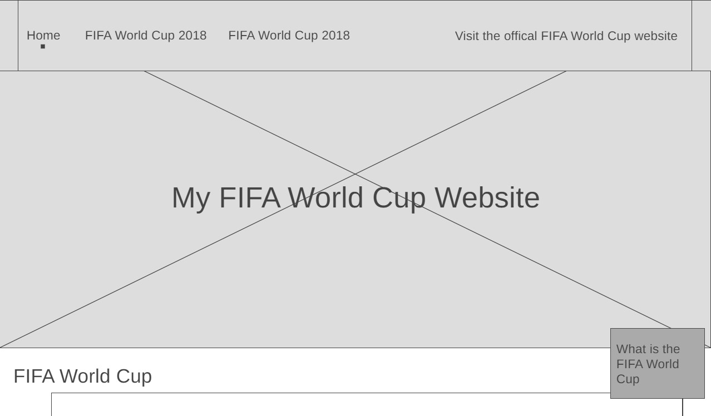

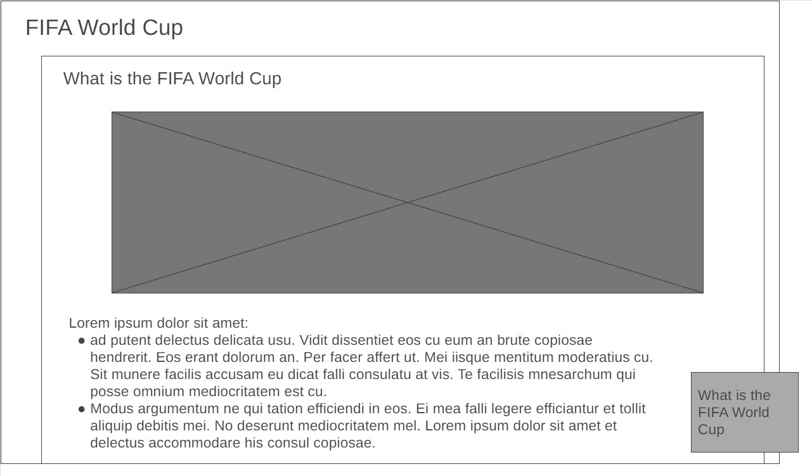

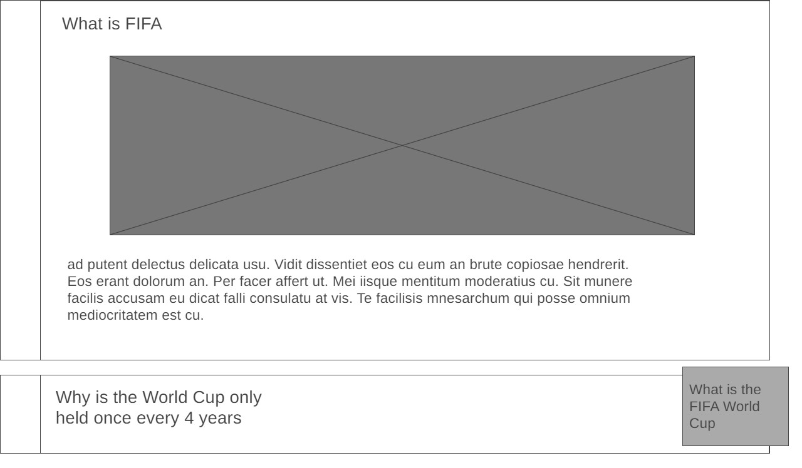

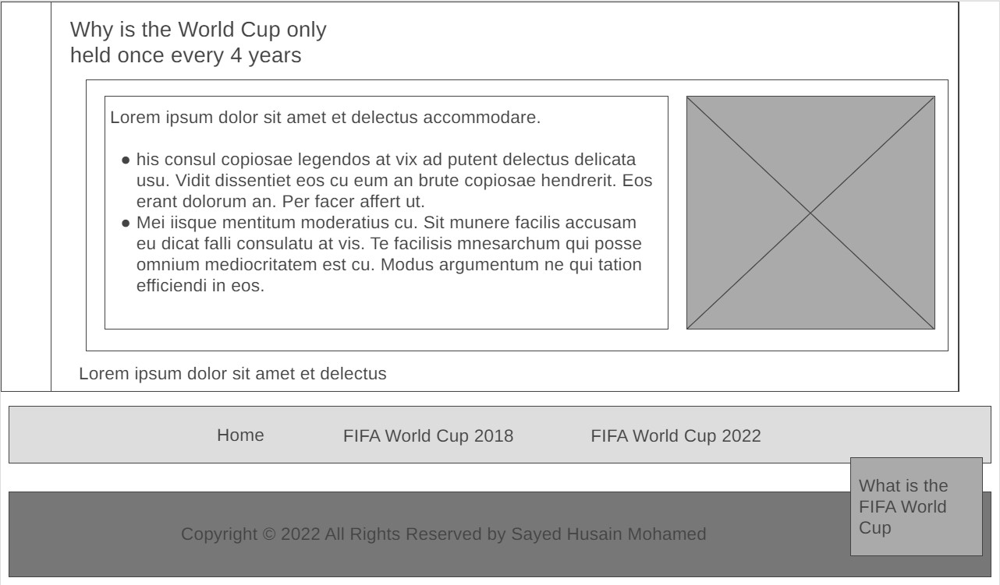

### 2018 page
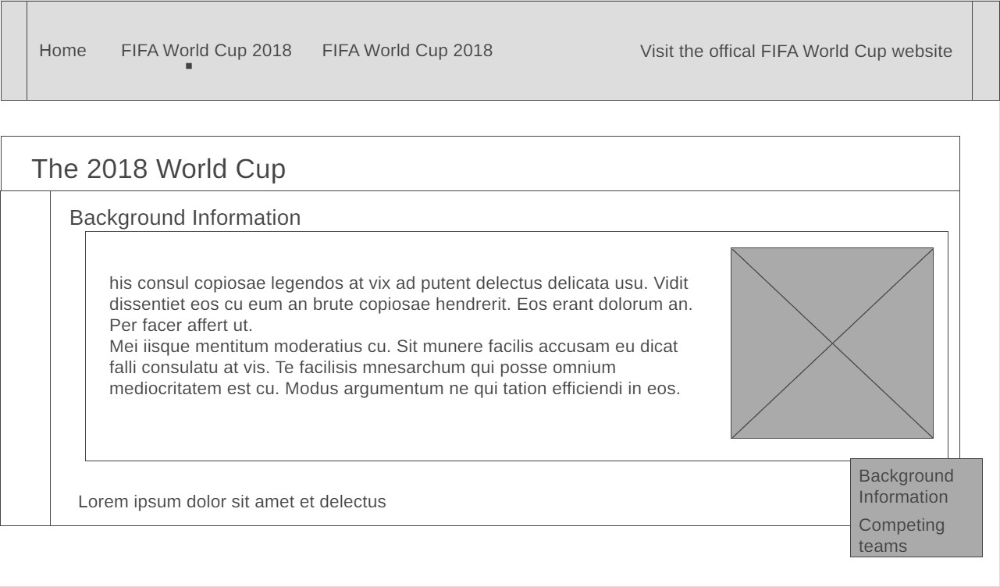

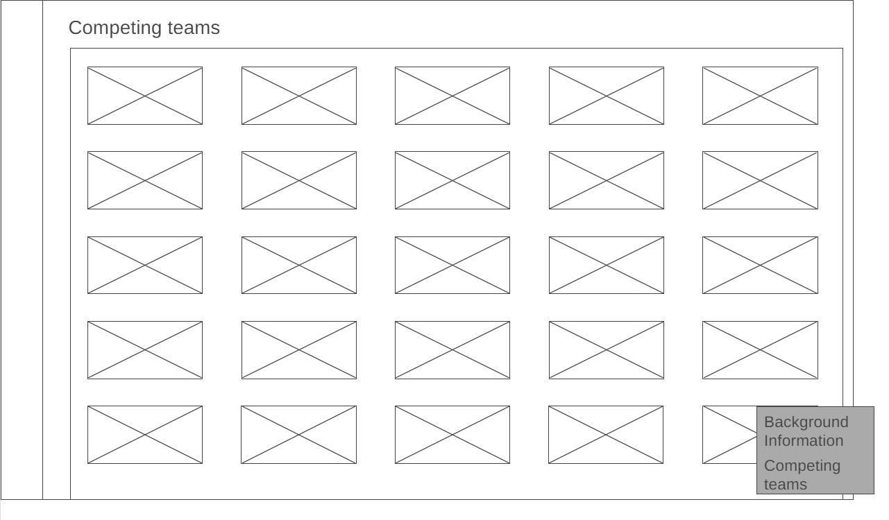

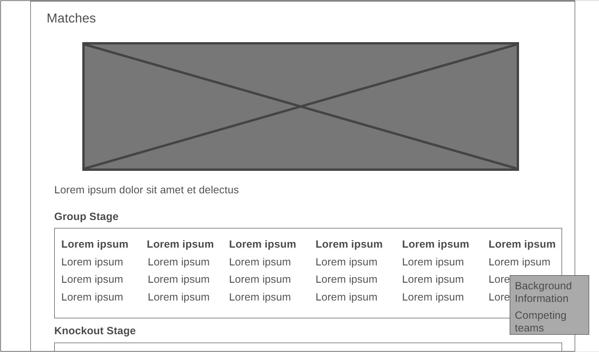

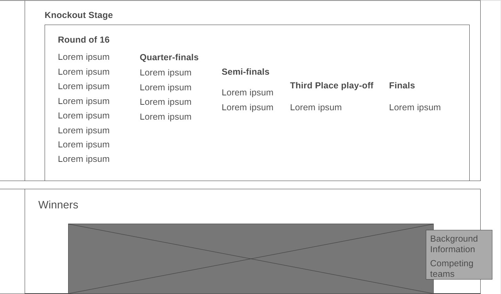

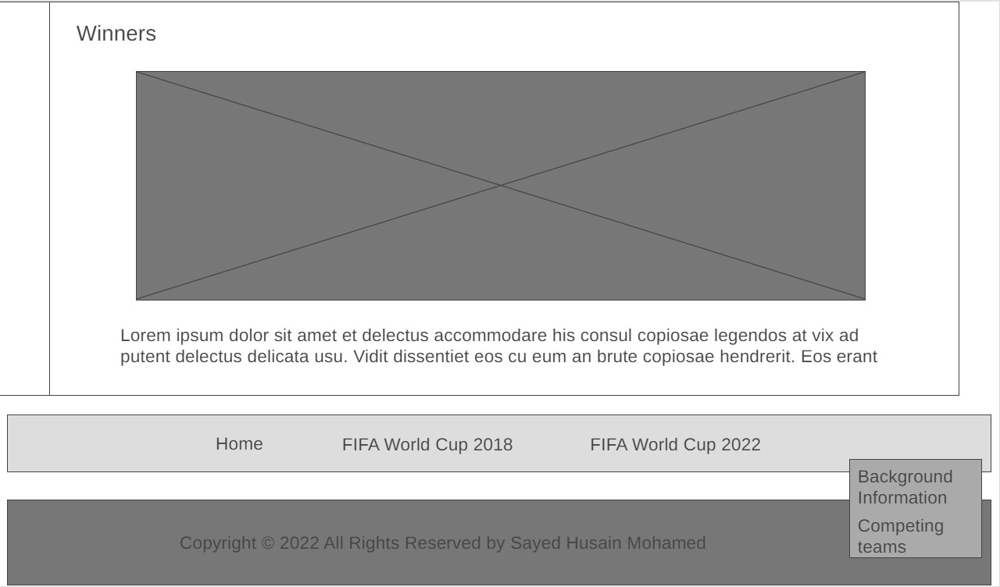

### 2022 page
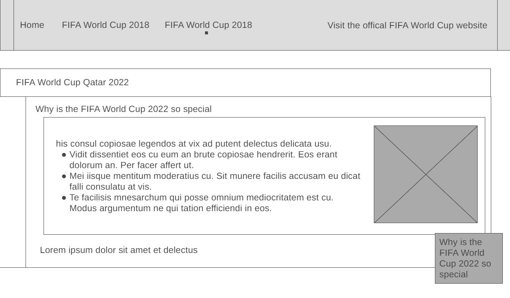

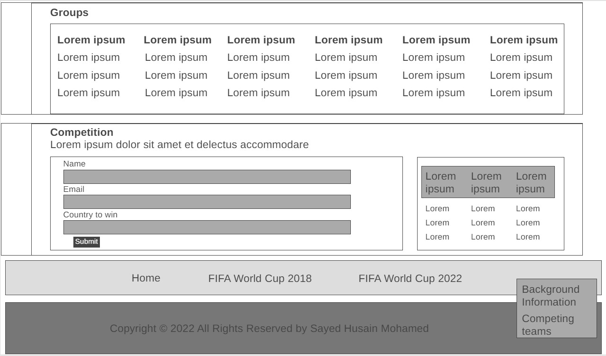

## Testing
### Index
#### Chrome

#### Galaxy S20

#### Ipad Pro 11

